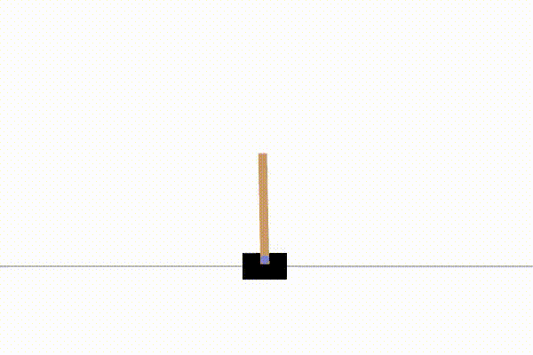
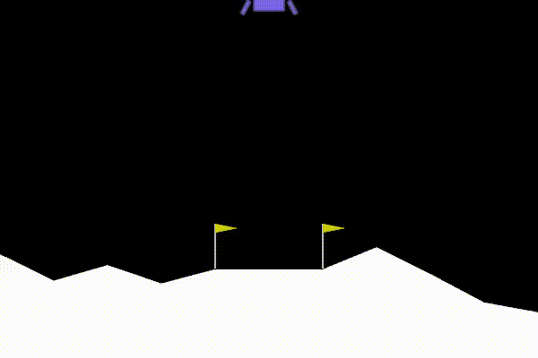

# Cartpole 

## Introduction 

This is a side project which I implement the deep Q network(DQN) to solve the cartpole problem. In this project I use the environment built by OpenAI gym. 

The goal of the agent is to keep the pole on the cart as long as possible, the cart can move left or right to balance it. The agent will get a +1 reward for every step taken.

## How to run this project
You need to install the packages such as [torch](https://pytorch.org/get-started/locally/) from pytorch and [gym](https://github.com/openai/gym) from OpenAI

### Train
You can run the program by

```
$ python main.py
```
### Display
which will start training the agent, and you can see the result from **rewards.png**.

To visualize the game, run 
```
$ python display.py 
```

You can run `main.py` and `display.py` at the same time to visualize the change of agent.

## Result
According to the documentation, the maximum reward an agent get can get is +500 per episode. 

The random policy is the baseline.

<p align="center">
    
</p>

<p align="center">
    
</p>


Although the noise during the training process is huge, the average reward is growing steadily which shows the agent is learning to do its job quite well.

## More Details

### Generalization
Since OpenAI gym built dozens of fantastic environments sharing the same interfaces(for example, all environments use the `env.step()` api to get the next transition), this project can interact with other environments by simply change the value of `env_name` in `main.py`(for example, change `CartPole-v1` to `LunarLander-v2`).

Note: You might want to tune some of the hyperparameters(such as `tau`) in the `Agent` class, otherwise the result is not guarenteed to converge.

Down below is the result of `main.py` running in the `LunarLander-v2` environment by simply change the value of `env_name`.

<p align="center">
    
</p>


<p align="center">
    
</p>


### How to pick a good agent?
In my implementation, after the agent get the `total_reward` better than the previous best record `best_episode` it becomes a candidate of the best agent of all time, then, it need to solve the problem `redo` more times to prove it is indeed the best. This method prevent some agents carry an outstanding performance in one episode but disastrous in the other to be considered the best agent and saved by the process.  

### GPU
This project use a relatively small neural network, so I train the agent directly on CPU, you need to add some code to train the agent on GPU if you want to. 

### Save the video recording
Run
```
$ python recorder.py 
```
Can save the result in mp4 format.

## Reference
1. [Playing Atari with Deep Reinforcement Learning](https://arxiv.org/pdf/1312.5602.pdf?source=post_page)
